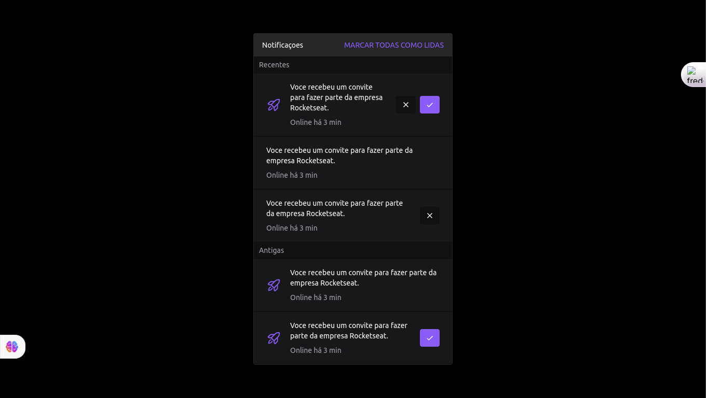

# Notifications Widget





## Technologies Used

The project was developed using the following technologies:

- Programming Language: **Typescript**
- [Next.js 13](https://nextjs.org/)
- [TailwindCSS](https://tailwindcss.com/)

## Installation Guide

This guide is designed to help you set up and run the Landing Page on your local machine for development and testing purposes.

### Requirements

Before starting the installation process, make sure you have the following tools installed on your system:

- [Node.js (versão 12 ou superior)](https://nodejs.org/)
- [Git](https://git-scm.com/)

To configure the local development environment, follow the steps below:

1. Clone this repository to your local machine.
```bash
git clone https://github.com/arnaldoucuassapi/notifications-widget.git
```

2. Install the required dependencies.
```bash
cd notifications-widget
npm install
```

3. Run the development server:

```bash
npm run dev
# or
yarn dev
# or
pnpm run dev
```

Open [http://localhost:3000](http://localhost:3000) with your browser to see the result.

Make sure you have the correct versions of technologies and dependencies installed to avoid compatibility issues.

## How to Contribute
If you want to contribute to the project, please follow the steps below:

1. Fork this repository and clone it to your local machine.
```shell
git clone https://github.com/arnaldoucuassapi/notifications-widget.git
```

2. Create a branch for your contribution.
```shell
git checkout -b minha-contribuicao
```

3. Make the necessary changes and commit them.
```shell
git commit -m "Description"
```

4. Push the changes to your fork repository.
```shell
git push origin minha-contribuicao
```

5. Open a pull request on this repository and wait for your contribution to be reviewed and approved.

I hope you enjoy the project and I look forward to receiving your contributions!
